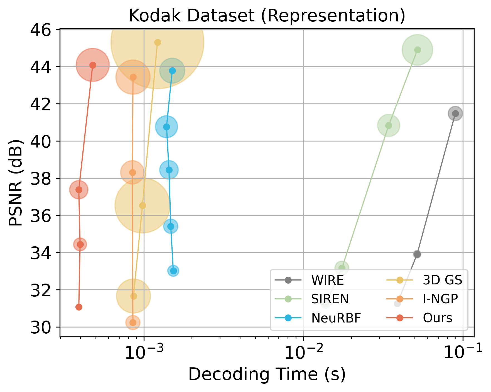
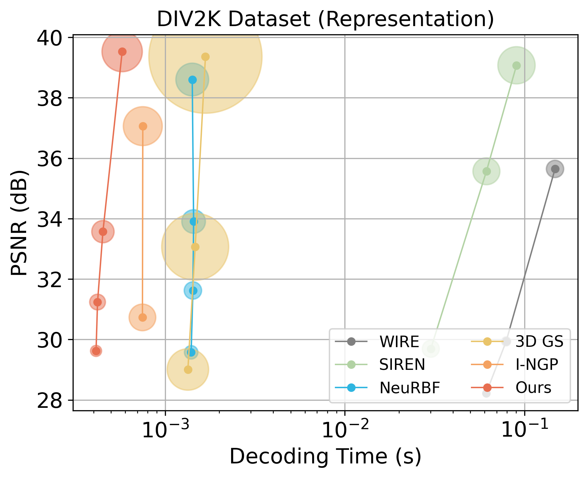
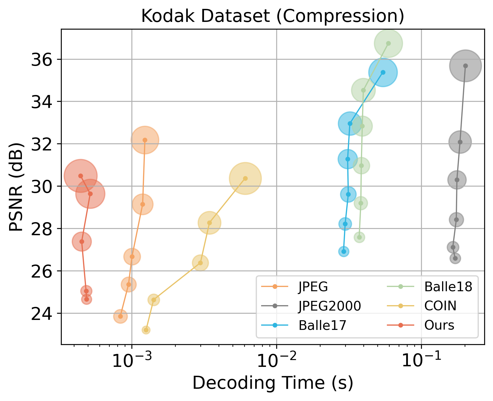
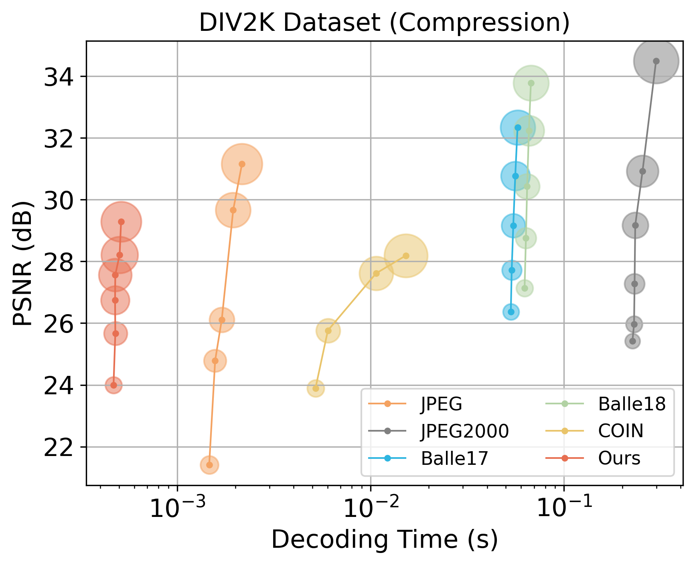
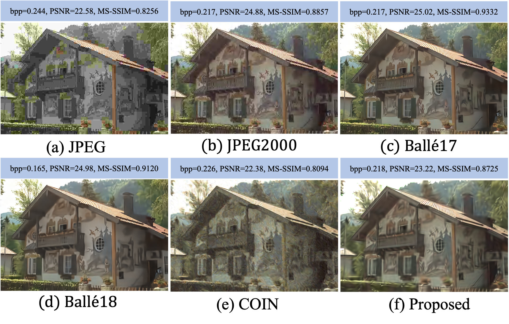
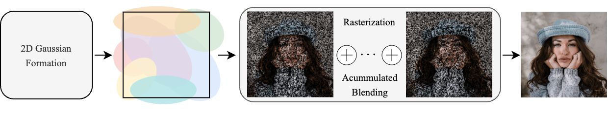

# GaussianImage: 1000 FPS Image Representation and Compression by 2D Gaussian Splatting
[](https://opensource.org/licenses/Apache-2.0) 
[](https://arxiv.org/abs/2403.08551)
[](https://github.com/Xinjie-Q/GaussianImage)

[[paper](https://arxiv.org/abs/2403.08551)][[project page](https://xingtongge.github.io/GaussianImage-page/)][[code](https://github.com/Xinjie-Q/GaussianImage)]

[Xinjie Zhang*](https://xinjie-q.github.io/), [Xingtong Ge*](https://xingtongge.github.io/), [Tongda Xu](https://tongdaxu.github.io/), [Dailan He](https://scholar.google.com/citations?user=f5MTTy4AAAAJ&hl=en), [Yan Wang](https://yanwang202199.github.io/), [Hongwei Qin](http://qinhongwei.com/academic/), [Guo Lu](https://guolusjtu.github.io/guoluhomepage/), [Jing Geng📧](https://cs.bit.edu.cn/szdw/jsml/fjs/gj/index.htm), [Jun Zhang📧](https://eejzhang.people.ust.hk/)

(* denotes equal contribution, 📧 denotes corresponding author.)

This is the official implementation of our paper [GaussianImage](https://arxiv.org/abs/2403.08551), a groundbreaking paradigm of image representation and compression by 2D Gaussian Splatting. With compact 2D Gaussian representation and a novel rasterization method, our approach achieves high representation performance with short training duration, minimal GPU memory overhead and ultra-fast rendering speed. Furthermore, we integrate existing vector quantization technique to build an low-complexity neural image codec. Remarkably, the decoding speed of our codec reaches around 2000 FPS, outpacing traditional codecs like JPEG, while also providing enhanced compression performance at lower bitrates. This establishes a significant advancement in the field of neural image codecs. More qualitative results can be found in our paper.

<div align="center">
  
  
</div>

<div align="center">
  
  
</div>

<div align=center>

</div>

## News

* **2024/7/8**: 🔥 We release our Python and CUDA code for GaussianImage presented in our paper. Have a try! Compared to the first version, we further improved the decoding speed of the GaussianImage codec to around 2000 FPS by removing the entropy coding operation, while only increasing the bpp overhead very slightly.

* **2024/7/1**: 🌟 Our paper has been accepted by ECCV 2024! 🎉 Cheers!

## Overview



Implicit neural representations (INRs) recently achieved great success in image representation and compression, offering high visual quality and fast rendering speeds with 10-1000 FPS, assuming sufficient GPU resources are available. However, this requirement often hinders their use on low-end devices with limited memory. In response, we propose a groundbreaking paradigm of image representation and compression by 2D Gaussian Splatting, named GaussianImage. We first introduce 2D Gaussian to represent the image, where each Gaussian has 8 parameters including position, covariance and color. Subsequently, we unveil a novel rendering algorithm based on accumulated summation. Remarkably, our method with a minimum of $3\times$ lower GPU memory usage and $5\times$  faster fitting time not only rivals INRs (e.g., WIRE, I-NGP) in representation performance, but also delivers a faster rendering speed of 1500-2000 FPS regardless of parameter size. Furthermore, we integrate existing vector quantization technique to build an image codec. Experimental results demonstrate that our codec attains rate-distortion performance comparable to compression-based INRs such as COIN and COIN++, while facilitating decoding speeds of approximately 2000 FPS. Additionally, preliminary proof of concept shows that our codec surpasses COIN and COIN++ in performance when using partial bits-back coding. 

## Quick Started

### Cloning the Repository

The repository contains submodules, thus please check it out with 
```shell
# SSH
git clone git@github.com:Xinjie-Q/GaussianImage.git --recursive
```
or
```shell
# HTTPS
git clone https://github.com/Xinjie-Q/GaussianImage.git --recursive
```
After cloning the repository, you can follow these steps to train GaussianImage models under different tasks. 

### Requirements

```bash
cd gsplat
pip install .[dev]
cd ../
pip install -r requirements.txt
```

If you encounter errors while installing the packages listed in requirements.txt, you can try installing each Python package individually using the pip command.

Before training, you need to download the [kodak](https://r0k.us/graphics/kodak/) and [DIV2K-validation](https://data.vision.ee.ethz.ch/cvl/DIV2K/) datasets. The dataset folder is organized as follows.

```bash
├── dataset
│   | kodak 
│     ├── kodim01.png
│     ├── kodim02.png 
│     ├── ...
│   | DIV2K_valid_LR_bicubic
│     ├── X2
│        ├── 0801x2.png
│        ├── 0802x2.png
│        ├── ...
```

#### Representation

```bash
sh ./scripts/gaussianimage_cholesky/kodak.sh /path/to/your/dataset
sh ./scripts/gaussianimage_rs/kodak.sh /path/to/your/dataset
sh ./scripts/3dgs/kodak.sh /path/to/your/dataset

sh ./scripts/gaussianimage_cholesky/div2k.sh /path/to/your/dataset
sh ./scripts/gaussianimage_rs/div2k.sh /path/to/your/dataset
sh ./scripts/3dgs/div2k.sh /path/to/your/dataset
```

#### Compression

After overfitting the image, we load the checkpoints from image representation and apply quantization-aware training technique to obtain the image compression results of GaussianImage models.

```bash
sh ./scripts/gaussianimage_cholesky/kodak_comp.sh /path/to/your/dataset
sh ./scripts/gaussianimage_rs/kodak_comp.sh /path/to/your/dataset

sh ./scripts/gaussianimage_cholesky/div2k_comp.sh /path/to/your/dataset
sh ./scripts/gaussianimage_rs/div2k_comp.sh /path/to/your/dataset
```

## Acknowledgments

Our code was developed based on [gsplat](https://github.com/nerfstudio-project/gsplat). This is a concise and easily extensible Gaussian Splatting library.

We thank [vector-quantize-pytorch](https://github.com/lucidrains/vector-quantize-pytorch) for providing the framework to implement residual vector quantization.

## Citation

If you find our GaussianImage paradigm useful or relevant to your research, please kindly cite our paper:

```
@inproceedings{zhang2024gaussianimage,
  title={GaussianImage: 1000 FPS Image Representation and Compression by 2D Gaussian Splatting},
  author={Zhang, Xinjie and Ge, Xingtong and Xu, Tongda and He, Dailan and Wang, Yan and Qin, Hongwei and Lu, Guo and Geng, Jing and Zhang, Jun},
  booktitle={European Conference on Computer Vision},
  year={2024}
}
```
